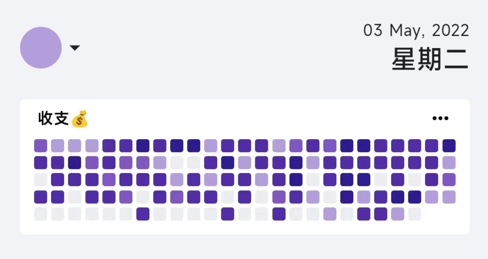
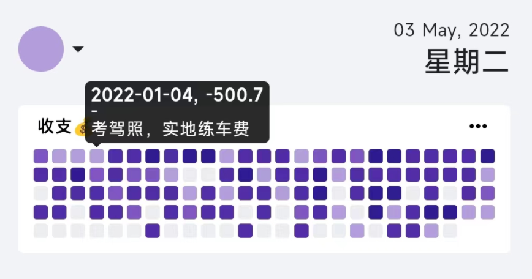
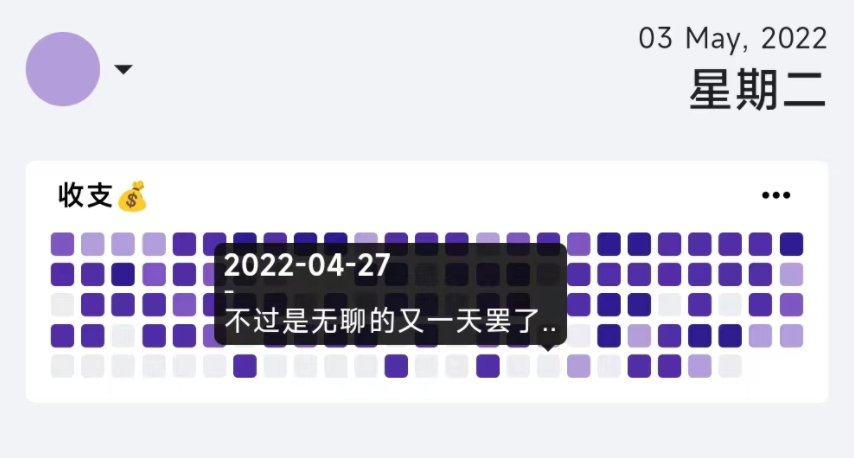
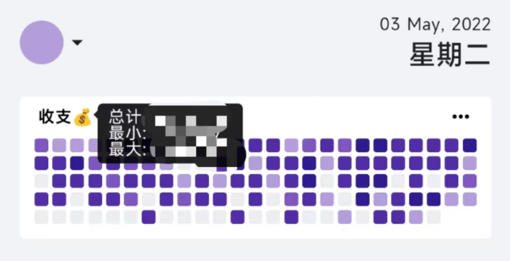
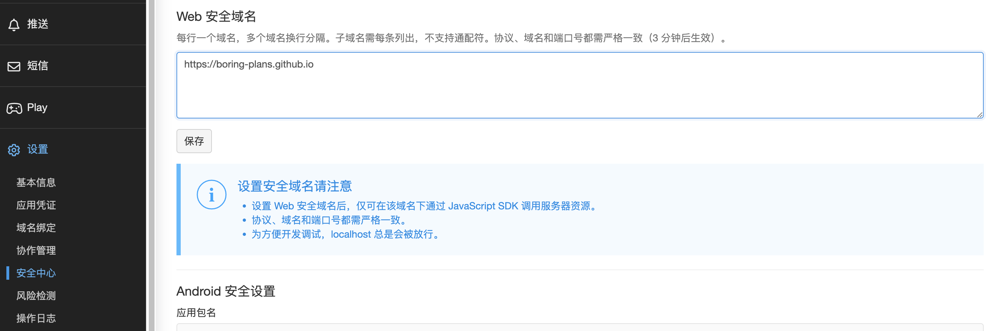

    
    <h1>Boring Days</h1>

节后第一周（2023/1/30-2023/2/3）比较闲，想起年前看到 Vuetify 3 正式发布了，于是将这个小工具翻新了一波。

主要变化：

- Vuetify 3 从 Beta 升级到正式（去掉诸多对 Beta 版的粗糙补救）
- 记录数据时，回车进行求和
- 优化布局、对话框们
- 深色主题

它现在的样子：

_以下是之前的介绍。_

---

今天（2022-05-03）也是等待 Vuetify 3 和 上海 Release 的一天。

## Preface

这是一个以热力图形式展示记录的记账类小玩具。它基于 `Vue3`、`Vite2`、`Vuetify3-Beta` 以及 `Lean Cloud`，基本效果是这样的：

## Getting Started

APP 托管在[这里](https://boring-days.tkzt.cn)。

比如说，你想记录每日喝水情况。

### 注册

首先，需要去 [Lean Cloud](https://console.leancloud.app/apps) 注册一个账号，并创建一个**国际版应用**（不需要绑定已备案的域名..😼）

然后在应用控制台中 `设置-应用凭证` 中获取到 `AppID` 和 `AppKey`，我们将以此登陆应用。

应用安全方面，Lean Cloud 采用白名单机制。默认情况下，Lean Cloud 不限制任何域名，这显然是不安全的，所以还需要在应用控制台 `设置-安全中心-Web 安全域名` 中添加 `https://boring-plans.github.io`（如果设置了，则仅允许指定的域名）。

### 新建主题

而后，App 中，点击右下角新建按钮 -> 点击新主题 -> 填写名称、选择主题色、设置高低值 -> 提交。

### 记录本日

而后，便可以在 `记录本日` 时，选择此主题、提交记录。

## Caveats

- Boring Days 的数据存储全权交给 Lean Cloud
- 显然，App ID 和 App Key 并非友好可读，所以建议勾选记住我
- ~~由于时间与地域的关系，如需补充本日以前的数据，只能通过 Lean Cloud 应用控制台操作~~
- ~~实践表明，Vuetify 3-Beta 在 Chromium 内核下表现良好，其余恐鸡飞狗跳~~
