# Boring Days

## Before Everything

今天（2022-05-03）也是等待 Vuetify 3 和 上海 Release 的一天。

## Preface

这是一个以热力图形式展示记录的记账类小玩具。它基于 `Vue3`、`Vite2`、`Vuetify3-Beta` 以及 `Lean Cloud`，基本效果是这样的：

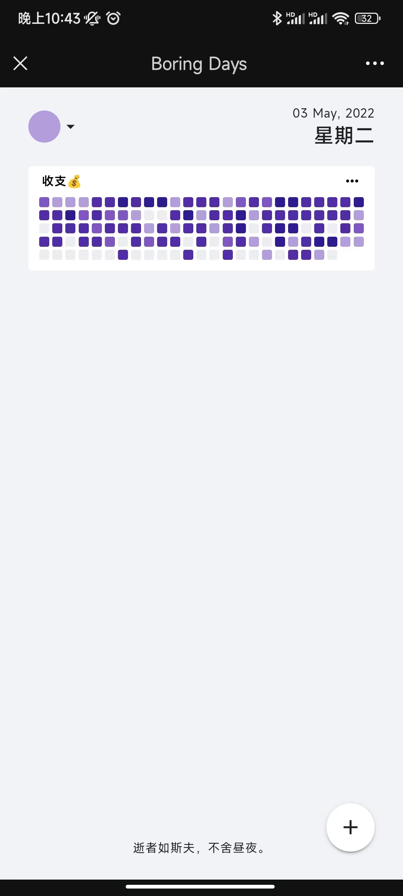
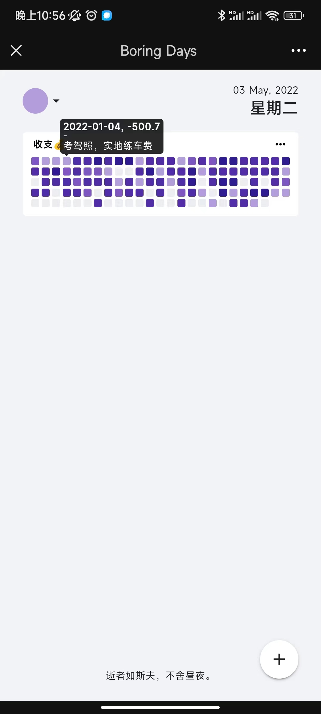
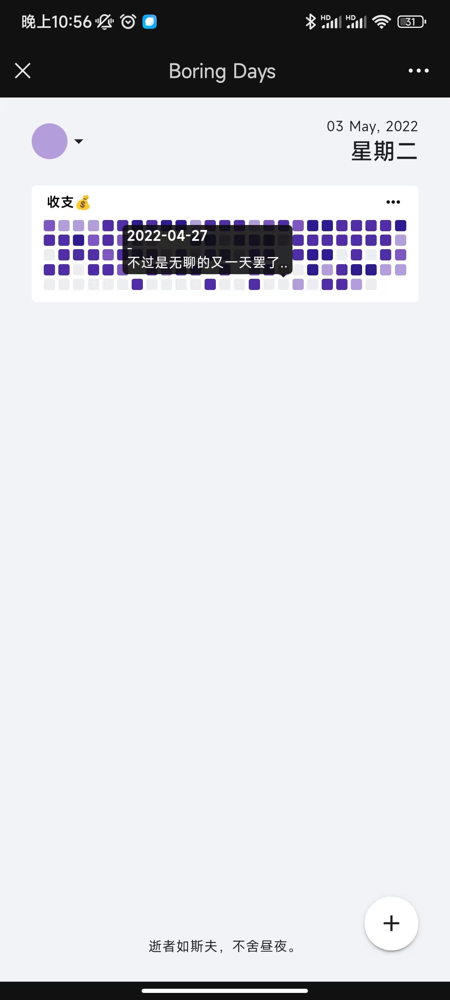
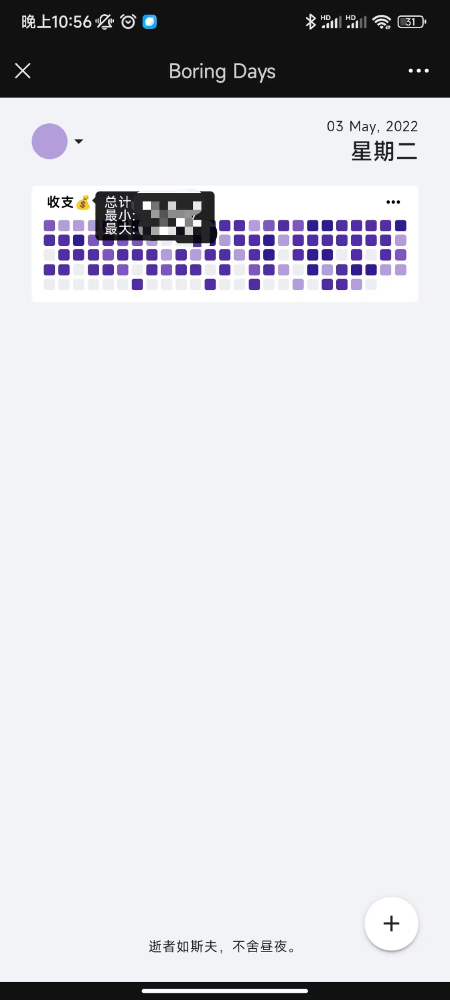

## Getting Started

APP 托管在[这里](https://https://boring-plans.github.io/boring-days)。

比如说，你想记录每日喝水情况。

### 注册

首先，需要去 [Lean Cloud](https://console.leancloud.app/apps) 注册一个账号，并创建一个**国际版应用**（不需要绑定已备案的域名..😼）

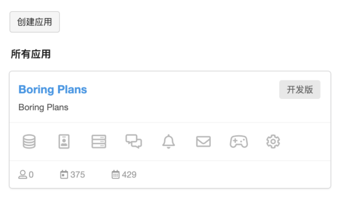

然后在应用控制台中 `设置-应用凭证` 中获取到 `AppID` 和 `AppKey`，我们将以此登陆应用。

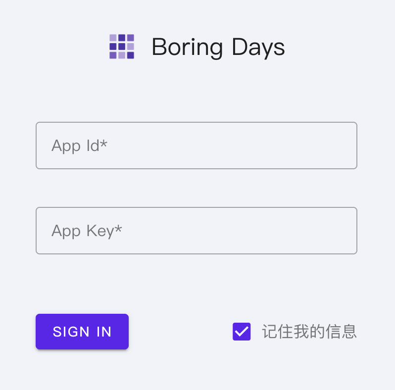

应用安全方面，Lean Cloud 采用白名单机制。默认情况下，Lean Cloud 不限制任何域名，这显然是不安全的，所以还需要在应用控制台 `设置-安全中心-Web 安全域名` 中添加 `https://boring-plans.github.io`（如果设置了，则仅允许指定的域名）。

<small>* Boring Days 的数据存储全权交给 Lean Cloud</small>
<small>* 显然，App ID 和 App Key 并非友好可读，所以建议勾选记住我</small>

### 新建主题

而后，App 中，点击右下角新建按钮 -> 点击新主题 -> 填写名称、选择主题色、设置高低值 -> 提交。

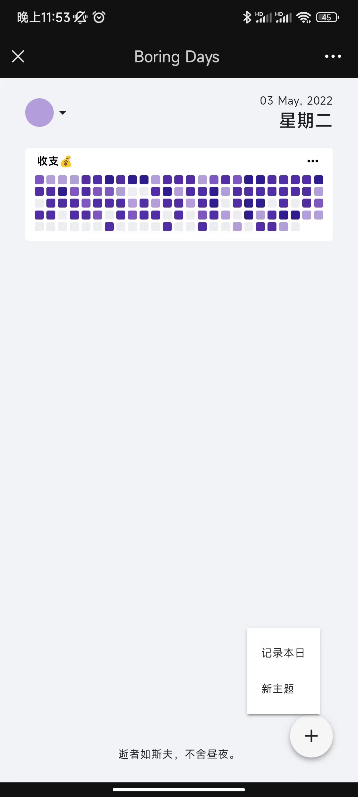
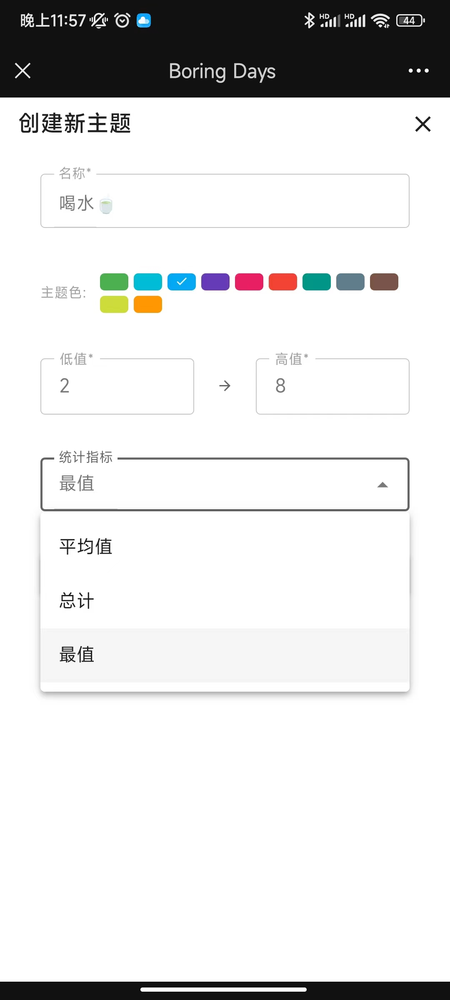
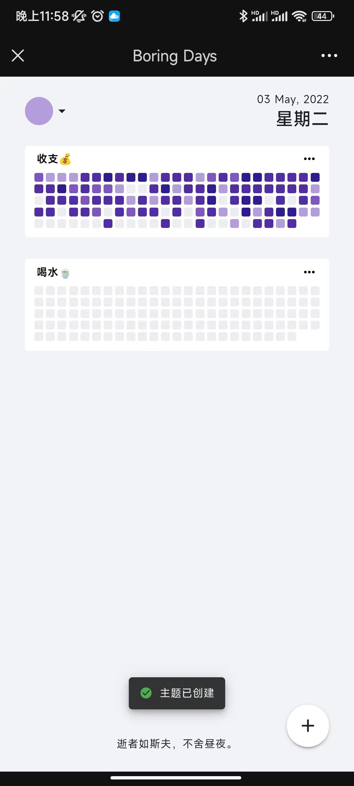

### 记录本日

而后，便可以在 `记录本日` 时，选择此主题、提交记录。

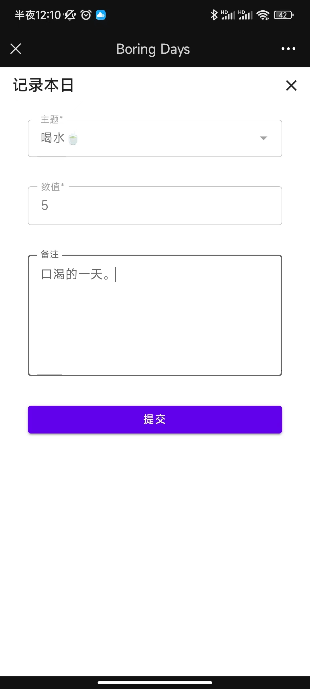
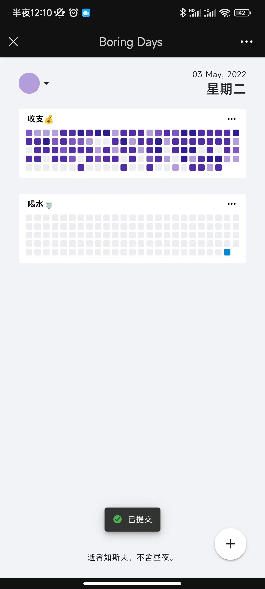
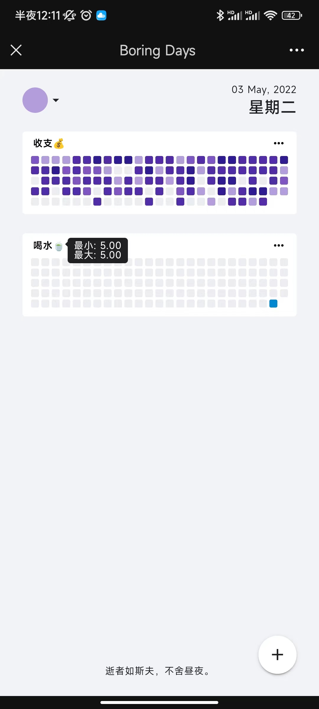

需要注意的是，如需补充本日以前的数据，只能通过 Lean Cloud 应用控制台操作。
